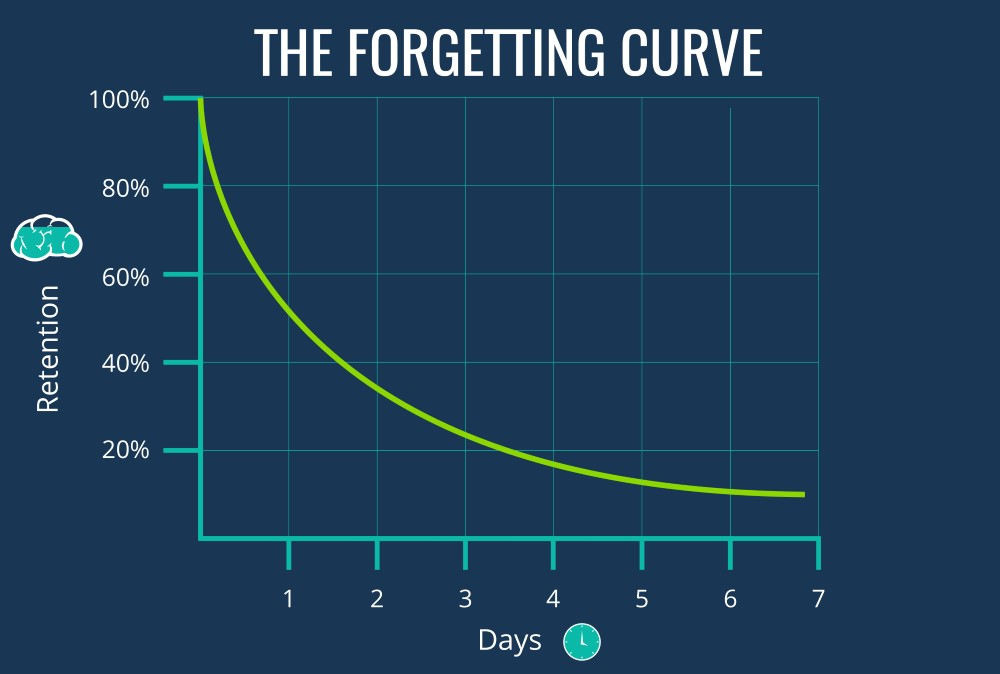
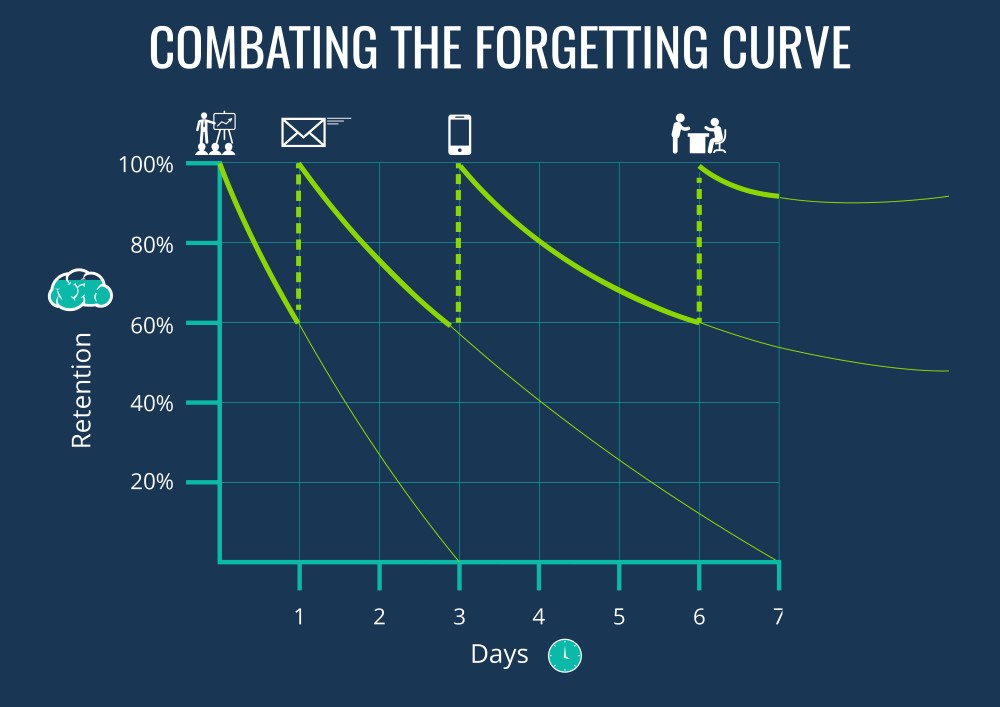
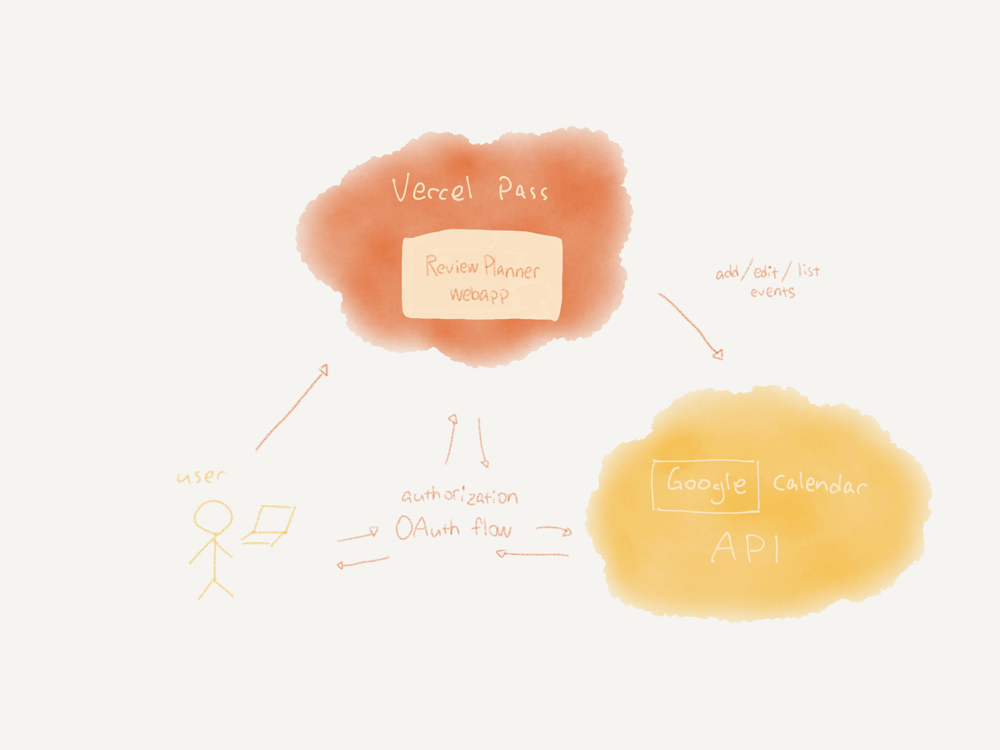
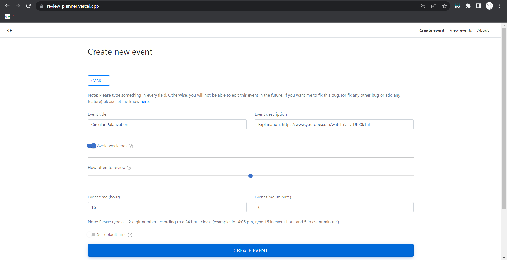
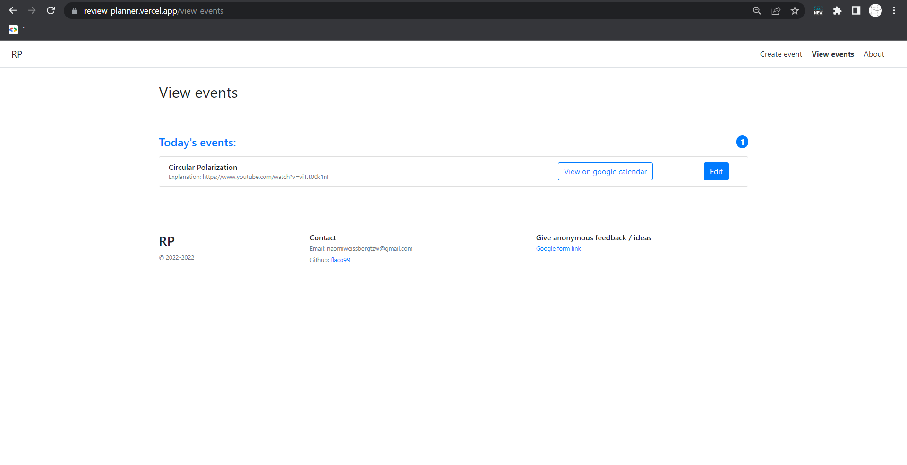
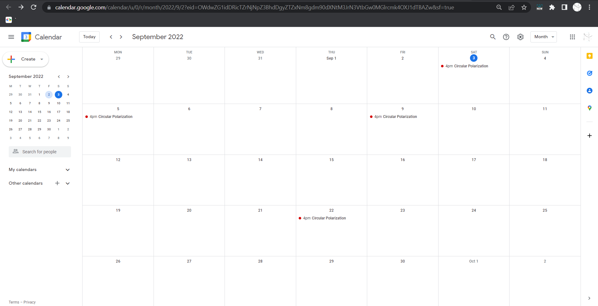

# Learning Review Planner

Retaining learned information over time is challenging.
[Ebbinghaus' Forgetting Curve](https://www.growthengineering.co.uk/what-is-the-forgetting-curve/)
claims that information retention is improved if you return to the 
learned material periodically (in exponentially increasing time gaps).


<sub>Image source: https://www.growthengineering.co.uk/what-is-the-forgetting-curve/</sub>


<sub>Image source: https://www.growthengineering.co.uk/what-is-the-forgetting-curve/</sub>

This webapp automates insertion of events to Google Calendar 
based on Ebbinghaus' theory.

## Architecture

Flask webapp, using [Google OAuth](https://developers.google.com/identity/protocols/oauth2) 
for authorization and [Google Calendar API](https://developers.google.com/calendar/api).

System diagram:


The webapp is available at https://review-planner.vercel.app/. 
Access to the app is by invitation. Contact me at naomiweissbergtzw@gmail.com to get an invite.

[Vercel](https://vercel.com/) is a PaaS that allows you to deploy Python 
webapps with a free tier.

Using the app:

<sub>Step 1: Fill out information and click "Create Event"</sub>

<sub>Step 2: Click "View on Google Calendar"</sub>



## Running locally
```shell
cd c:\path\to\app
set OAUTHLIB_INSECURE_TRANSPORT=1
set FLASK_APP=index
set FLASK_SECRET_KEY=ignored
set FLASK_ENV=development
set FLASK_DEBUG=1
set /p CLIENT_SECRET_JSON=<C:\path\to\client_secret.json
venv\Scripts\activate
flask run
```

and then access the app on http://localhost:5000